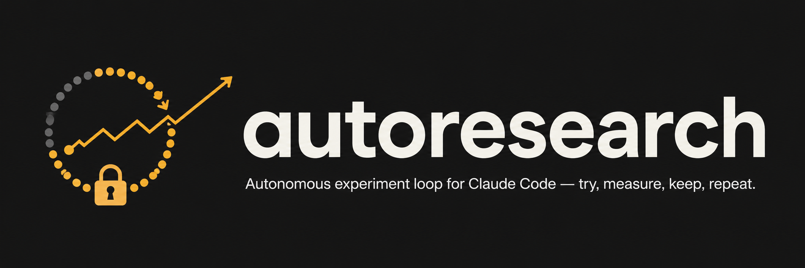

# autoresearch-claude-code



[](LICENSE)

A measured experiment loop for **Claude Code and Codex**. Define a goal, a fixed
benchmark, and files to modify. The agent tries changes, measures results, commits
supported improvements, and records failed ideas within a budget.

Inspired by [pi-autoresearch](https://github.com/davebcn87/pi-autoresearch).
The experiment protocol is a shared skill with standard-library Python helpers;
no MCP server is required.

## Install

Requires **Python 3.10+, Bash, Git**, and your chosen agent client. Linux and macOS
are supported; use WSL on Windows. The optional ML example has its own dependencies.

```bash
gh repo clone drivelineresearch/autoresearch-claude-code
cd autoresearch-claude-code
./install.sh --codex      # Codex skill in ~/.agents/skills/autoresearch
./install.sh --claude     # Claude skill, command, and four hooks
# Or: ./install.sh --all
```

No argument defaults to Claude for compatibility. Installations use symlinks, so
keep this checkout in place. Existing foreign files/directories are preserved and
conflicts are reported. Claude settings are validated before changes, updated
atomically, and backed up when modified. Codex installation does not edit its
configuration or register Claude hooks.

Claude also supports a session-local plugin load:

```bash
claude --plugin-dir /absolute/path/to/autoresearch-claude-code
```

Choose plugin loading or manual Claude installation; installing both can duplicate
hooks. For removal, use `./uninstall.sh --codex`, `--claude`, or `--all`. Removal
only deletes symlinks owned by this checkout and corresponding exact hook entries;
manually copied files and other installations remain untouched. See
[installation/review notes](docs/review.md) for migration limits.

## Quick start

In **Codex CLI/IDE**, invoke the installed skill:

```text
$autoresearch optimize test suite runtime with at most 20 runs
$autoresearch status
$autoresearch report
$autoresearch off
```

In the Codex app, select the skill or ask to use `autoresearch` by name. Codex
[discovers symlinked skills in ~/.agents/skills](https://learn.chatgpt.com/docs/build-skills).
For **Claude Code**, use `/autoresearch` with the same goal or subcommands.

The agent establishes scope, creates an experiment branch, prepares a fixed
benchmark, calibrates noise, and logs a baseline. It preserves existing work;
use a dedicated worktree when another task is in progress. Artifacts must be
ignored in the target project too; this plugin's ignores do not transfer.

For unattended Codex execution, first initialize and pause the session with the
skill, review the baseline, then explicitly resume it and run:

```bash
# Run from the initialized experiment worktree after reviewing/removing its pause sentinel.
python3 ~/.agents/skills/autoresearch/scripts/codex_loop.py --dry-run
python3 ~/.agents/skills/autoresearch/scripts/codex_loop.py \
  --max-turns 10 --max-seconds 3600 --turn-timeout 300 \
  --protect path/to/scorer.py
```

Replace `path/to/scorer.py` with your real scorer file; repeat `--protect` for other
locked inputs. See the [Codex guide](skills/autoresearch/references/codex.md) for
initialization, flags, logs, pause/cancellation, and recovery.

## What is enforced

| Capability | Mechanism and limit |
|---|---|
| Shared state | Config/result JSONL validated for finite numbers, sequential runs, segments, status, and metadata; writes locked and atomic |
| Claude continuation | Stop hook blocks turn completion while an active valid session has budget; malformed state allows stopping with a diagnostic |
| Codex continuation | Bounded `codex exec` supervisor requires one result per invocation; stops on no progress, failure, altered config, branch, or protected files |
| Budgets | Current-segment run/time/target checks; Codex also caps invocations and actively times out process groups |
| Pause | `.autoresearch-off`; Codex checks during active turns as well as between them |
| Recovery | JSONL, worklog, dashboard; Claude PreCompact snapshots and SessionStart context |
| Noise/correctness | Agent follows measured-noise and checks protocol; helpers do not independently attest a score or statistical significance |
| Locked scorer | Off-limits scope instructions, plus Codex hashes for specified files between turns; this is not a hostile-agent sandbox |

Run caps count logged experiments (including baseline and failures), not tokens or
dollars. Setup/calibration and seed confirmations have additional cost. Claude's
Stop hook checks at turn boundaries; a benchmark needs its own timeout. A budget
extension or scorer change must be deliberate; removing a pause sentinel alone
never resets the budget.

Keep/discard uses **strict improvement beyond the noise floor** and passing
correctness checks. Fix dataset splits, training-only preprocessing, and scoring
before optimizing; changing the evaluation definition starts a new segment.

The exact workflow is in [SKILL.md](skills/autoresearch/SKILL.md), with
[state commands/schema](skills/autoresearch/references/state.md). The
[full review and roadmap](docs/review.md) records findings, changes, validation,
and remaining limitations.

## Example: fastball velocity prediction

The [OpenBiomechanics example](examples/obp-autoresearch.md) demonstrates the model
interface, athlete-grouped evaluation, and `METRIC name=number` output.

```bash
cd examples
uv sync
mkdir -p third_party
gh repo clone drivelineresearch/openbiomechanics third_party/openbiomechanics -- --depth 1
./autoresearch.sh 42
```

Run in `examples/`; do not copy training files out of their uv project. Data paths
are relative to the script. Optional backends: `uv sync --extra torch`,
`--extra boost`, `--extra tabpfn`, `--extra tabnet`, or `--extra all`. Some optional
backends need compatible GPU builds, credentials/model downloads, or extra setup.

The 19 registered models cover boosting, neural/tabular models, linear/Bayesian
regression, SVR/KNN, and stacking. They load optional dependencies only when selected;
GPU support depends on the backend and installed build. Start with a CPU backend
to verify your data and evaluation contract.

**Historical result caveat:** the archived worklog reports R² 0.440 → 0.783, but it
used feature selection informed by held-out data and changed aggregation/CV during
the search. Those scores are not a validated like-for-like improvement or an
independent new-player accuracy estimate. The [original narrative](experiments/worklog.md)
is preserved with that qualification. Current code uses training-fold feature
selection and keeps held-out labels out of fitting; rerun a fixed protocol to
establish a new baseline. No replacement accuracy claim is supplied by this review.

## Development

```bash
python3 -m unittest discover -s tests -v
shellcheck install.sh uninstall.sh hooks/*.sh skills/autoresearch/scripts/*.sh examples/autoresearch.sh
```

Core tests need only the standard library; example tests skip if their scientific
packages are absent. To exercise them: `uv sync --project examples`, then
`uv run --project examples python -m unittest discover -s tests -p test_examples.py -v`.
CI runs core tests on Linux/macOS and the example suite with core dependencies.
Fake-CLI tests validate supervisor behavior; authenticated Codex runs and optional
GPU/model backends require separate integration checks.
The real Codex keep/commit/log cycle is now verified after repairing this host's
Ubuntu AppArmor profile and granting scoped Git metadata writes. Sandbox boundary
checks also passed. See the [sandbox repair and verification report](docs/codex-sandbox.md).

Contributor guidance: [AGENTS.md](AGENTS.md). License: [MIT](LICENSE).
